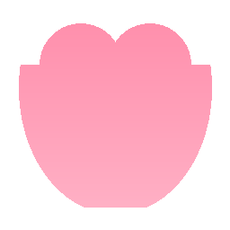

# 🐾 DesktopPet 可爱的二次元桌宠

一个基于 Electron + Vue 3 + PIXI.js + Live2D 的桌面宠物。她会在你的桌面上待机、闲聊、撒娇，支持摸头、戳身体等互动，还能随时切换不同形象。



## ✨ 功能特性

- **Live2D 形象**：默认使用 [Hiyori（桃濑日和）](https://www.live2d.com/zh-CHS/learn/sample/momose-hiyori/) —— 浅粉色头发的可爱女生，Live2D 官方免费素材
- **运行时切换形象**：右键桌宠 → 「切换形象」，可挑选 `models/` 下任意已放置的模型，选择会持久化，下次启动自动恢复
- **互动反馈**
  - 摸头 → 摇头躲闪动作 + 撒娇台词
  - 点击身体 → 随机互动动作 + 对话气泡
  - 连续点击次数累计到 5 次会触发特殊对话
- **自动行为**：定时随机播放 idle 动作，定时弹出闲聊台词
- **窗口**：透明背景、无边框、置顶、可拖动
- **点击穿透**：模型区域可交互，空白区域事件透传到桌面
- **托盘菜单**：显示/隐藏、退出
- **设置面板**：宠物大小、对话频率、开机自启、窗口置顶
- **兼容多种 Live2D 格式**：同时支持 Cubism 2（`*.moc` / `*.model.json`）与 Cubism 3+（`*.moc3` / `*.model3.json`）

## 🚀 快速开始

### 环境要求

- Node.js ≥ 18
- npm
- Windows（已测试；macOS/Linux 渲染可行但未做打包适配）

### 安装依赖

```bash
npm install
```

### 开发模式

```bash
npm run dev
```

会同时启动 Vite 开发服务器和 Electron 窗口。开发模式下模型文件由 Vite 中间件以 HTTP 提供，避免跨域读取 `file://` 资源被拦截。

### 打包成 Portable 可执行文件

```bash
npm run build:portable
```

产物在 `electron-builder.yml` 中 `directories.output` 指定的目录下（默认 `build-out/DesktopPet-portable.exe`），双击即可运行，无需安装。

其它脚本：

- `npm run build` —— 走默认打包目标
- `npm run preview` —— 仅预览 Vite 构建结果

## 🎀 切换形象 / 添加新形象

1. 准备一个 Live2D 模型包（runtime 文件夹，包含 `*.model3.json`、`*.moc3`、贴图、动作、物理等）
2. 在项目根 `models/` 下新建一个子目录，把 runtime 文件放进去，例如：

   ```
   models/
     hiyori_pro/      ← 默认形象
       runtime/
         hiyori_pro_t11.model3.json
         hiyori_pro_t11.moc3
         hiyori_pro_t11.2048/texture_*.png
         motion/*.motion3.json
         ...
     haru/            ← 旧版 Haru 形象
       haru01.model.json
       ...
     <你的新形象>/     ← 任意文件夹名
       xxx.model3.json
       ...
   ```

3. 运行时右键桌宠 → 「切换形象」会自动列出所有含模型文件的子目录，选中即可即时切换，无需重启。选择会被保存到 `%APPDATA%/desktop-pet/model-prefs.json`，下次启动自动加载。

> 模型发现是递归扫描：模型文件不必放在子目录第一层，放在 `runtime/` 这种二级目录里也能被识别。

## 🖱 操作说明

| 操作 | 效果 |
|---|---|
| 左键拖动 | 移动桌宠位置 |
| 左键点击 头部 | 摸头动作 + 撒娇台词 |
| 左键点击 身体 | 互动动作 + 对话 |
| 右键 | 上下文菜单（切换形象 / 隐藏 / 置顶 / 退出） |
| 双击托盘图标 | 显示 / 隐藏 |

## 🧱 项目结构

```
desktop-pet/
├── electron/
│   ├── main.ts          Electron 主进程：窗口、托盘、IPC、模型扫描、偏好持久化
│   └── preload.ts       上下文桥接，暴露 electronAPI
├── src/
│   ├── App.vue          渲染进程根组件
│   ├── components/
│   │   ├── pet/
│   │   │   ├── PetCanvas.vue   Live2D 模型加载、互动、切换形象
│   │   │   └── ChatBubble.vue  对话气泡
│   │   └── settings/
│   │       └── SettingsPanel.vue  设置面板
│   ├── composables/      useWindowDrag / useClickThrough / useChatSystem ...
│   ├── engine/           DialogEngine / IdleBehavior / MoodSystem / MotionController
│   └── styles/main.css
├── models/              Live2D 模型资源（hiyori_pro / haru ...）
├── externals/           live2d.min.js / live2dcubismcore.min.js（Cubism Core）
├── resources/           应用图标
├── electron-builder.yml 打包配置
└── vite.config.ts       Vite + Electron 插件配置
```

## 🔧 技术栈

| 领域 | 选型 |
|---|---|
| 桌面框架 | Electron 33 |
| 渲染 | Vue 3 + Vite 6 |
| Live2D 渲染 | pixi-live2d-display 0.4 + PIXI.js 6 |
| Live2D Core | Cubism 2 (`live2d.min.js`) + Cubism 4 (`live2dcubismcore.min.js`) |
| 打包 | electron-builder 25 |

## 📜 许可与致谢

- **Hiyori（桃濑日和）** 模型为 [Live2D 官方免费素材](https://www.live2d.com/zh-CHS/learn/sample/momose-hiyori/)，版权归 Live2D Inc. 及插画师 Kani Biimu 所有，遵循 [《免费提供素材使用授权协议》](https://www.live2d.com/eula/live2d-free-material-license-agreement_cn.html)。本项目仅用于学习与个人使用。
- **Haru** 模型来自 `live2d-widget-model-haru`。
- 本项目代码可自由学习、二次修改；二次分发模型素材请遵守对应模型的原作者授权条款。

---

愿你桌面的她每天都让你微笑 :)